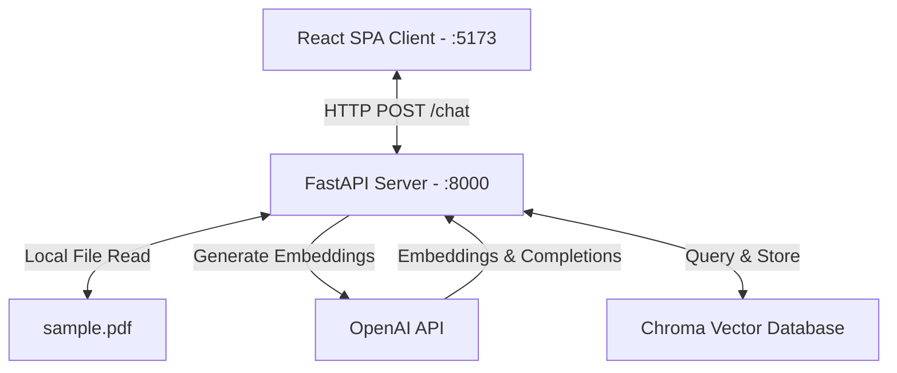

# 🧠 Project Brain: Fast & Furious Car Showroom

This document outlines the core architecture, data flows, AI logic, and roadmap of the **Fast & Furious Car Showroom** system.

---

## 🏗️ System Architecture

The project is structured as a decoupled Single Page Application (SPA) frontend and a Python-based microservice backend.



---

## 🤖 AI Receptionist & RAG Pipeline

The AI Receptionist is built on a **Retrieval-Augmented Generation (RAG)** architecture using **LangChain**.

### 1. Vector Store Initialization (At Startup)
When the FastAPI application boots up:
1. **Document Loading**: The `PyPDFLoader` parses `sample.pdf` from the disk.
2. **Text Splitting**: The document is split into smaller, manageable chunks using `RecursiveCharacterTextSplitter` (`chunk_size=500`, `chunk_overlap=50`).
3. **Embedding Generation**: Text chunks are embedded using OpenAI's `OpenAIEmbeddings`.
4. **Vector Store**: The embeddings and source text chunks are loaded into a local, persistent **Chroma DB** store (`backend/chroma_store/`).

### 2. Query/Response Pipeline (`POST /chat`)
When a user asks a question in the frontend chat panel:
```
[User Question]
       │
       ▼
[Retrieve Similar Documents] (Chroma vector store fetches top K=2 relevant chunks)
       │
       ▼
[Format Prompt] (Injects Context + User Question into Prompt Template)
       │
       ▼
[LLM Processing] (gpt-3.5-turbo compiles the response)
       │
       ▼
[StrOutputParser] (Extracts clean string output)
       │
       ▼
[Response sent to Frontend]
```

### 3. Prompt Constraints
The chatbot uses strict prompting rules:
* Uses **only** the provided PDF context to formulate answers.
* If the information is not present in the context, it answers: `"I could not find the answer in the document."`
* Operates with `temperature=0` to ensure highly accurate, deterministic responses without hallucinations.

---

## 🔌 API Documentation

### **Root Status Endpoint**
* **Method:** `GET`
* **Path:** `/`
* **Response:**
  ```json
  {
    "message": "Static PDF Chatbot is running."
  }
  ```

### **Chat Endpoint**
* **Method:** `POST`
* **Path:** `/chat`
* **Headers:** `Content-Type: application/json`
* **Request Body:**
  ```json
  {
    "question": "What are your opening hours?"
  }
  ```
* **Success Response (200 OK):**
  ```json
  {
    "answer": "Our showroom is open from Monday to Saturday, 9:00 AM to 8:00 PM."
  }
  ```
* **Failure Response:**
  ```json
  {
    "error": "Detailed description of exception."
  }
  ```

---

## 🛠️ Future Roadmap

1. **Session-based Chat Memory:**
   * Currently, the chatbot is stateless (each question is answered in isolation).
   * **Plan:** Integrate LangChain's `RunnableWithMessageHistory` to support conversational context.

2. **Supabase Database Integration:**
   * Save test drive bookings from `TestDrive.tsx` and contact form submissions from `ContactUs.tsx` into Supabase tables instead of just simulating client-side actions.

3. **Dynamic PDF uploads:**
   * Instead of a hardcoded `sample.pdf`, create an admin dashboard in the frontend to upload new documents dynamically, which the backend will split and append to Chroma DB.

4. **Production Vector Database:**
   * Transition local Chroma DB to Supabase pgvector or Pinecone to support persistent serverless deployments.
